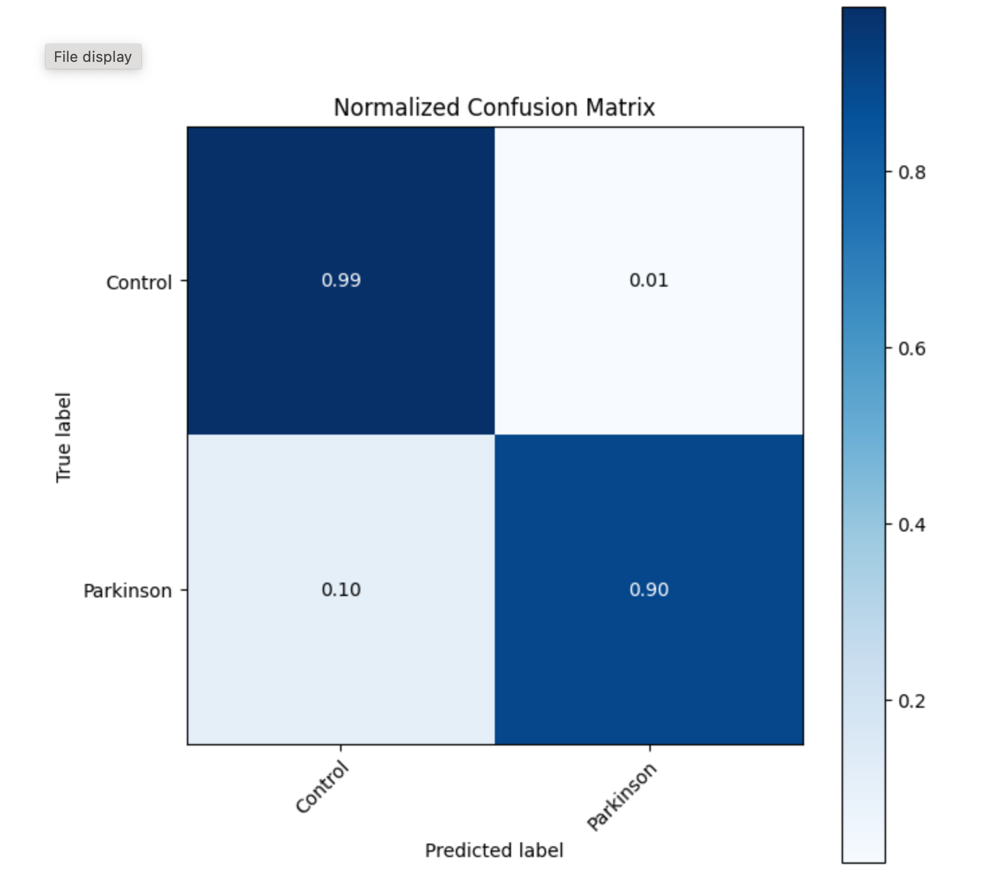

# Parkinson-Test_Classifier
***
## About project
A skill-demonstration project where I create LSTM-RNN model and train it to classify data of Parkinson's tests (e.g SS-test, DS-est and CM-Test. Read more above) for pesence/abscence of Parkinson disease features 
***
## Technology Stack:
### 1. Core Technologies:
  * **PyTorch**:
    * Implemented **RNN/LSTM/GRU** for time-series or sequential data.
    * Utilized automatic differentiation (autograd).
    * GPU (CUDA) support for accelerated training.
  * **Python**: Primary programming language.
### 2. **Data Processing**:
  * Data Sources:
      - Parkinson’s disease datasets (e.g., UCI Machine Learning Repository, Physionet).
      - Formats: CSV, sensor time-series. 
  * Data Processing Libraries:
     * **Pandas**: Data loading, cleaning, and preprocessing.
     * **NumPy**: Handling multidimensional arrays.
     * **Scikit-learn**:
       * Normalization/scaling (MinMaxScaler, RobustScaler StandardScaler).
       * Train/validation/test split.
       * Evaluation metrics (accuracy, F1-score, ROC-AUC).
### 3. **Model Architecture**:
  * Neural Network Layers:
      * Recurrent layers (RNN, LSTM, GRU).
      * Fully connected layers (Linear).
      * Regularization: Dropout, BatchNorm.
  * Activation Functions: ReLU, Sigmoid, Softmax.
### 4. **Development Tools**:
  * Version Control: Git + GitHub/GitLab.
  * IDE: Jupyter Notebook, PyCharm.
***
## Run Guide
* Clone directory
* Install __requirements.txt__
* Open __Test_Usage.py__
* In line 14 _prepare_data(load_data(...))_ paste path for data file (can find it in _'Process of creating/Dataset' + '/control' or '/parkinson'_)
* Outputs in command line will be a prediction made by model
***

<b>Tap to see confusion matrix of trained model</b>

 
 **ROC-AUC score: 97.8**

